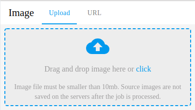
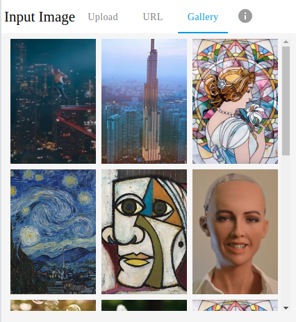
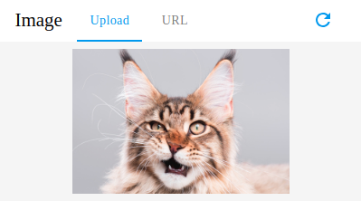

# SNET Image Upload Component

This repository contains the official [Material UI](https://material-ui.com/) based image upload component for SingularityNET services.

## General Funcionality

This component is composed of a tool bar (at the top) and a main tab below it. The top bar consists of:
 
- The image name (that can be set by "imageName" parameter);
- A tab chooser composed of:
    - Upload: a dropzone that allows the user to upload an image from their computer by clicking or dragging and dropping a file. Will display a "file rejected" message if the user tries to drop a file that exceeds "maxImageSize" or an image type that is not listed under "allowedInputTypes";
    - URL: allows users to select images using their URL;
    - Gallery: an optional tab that can be used if the service provider would like to suggest example images. Will be rendered if the "imageGallery" parameter (a list of image URLs) is provided. 
- An optional info tip that will be rendered if the "infoTip" parameter is not empty. It is an "Info" icon that displays a tooltip with the specified string when hovered upon.
- A reset button that is rendered after the user uploads an image that allows them to choose another image.

After the user chooses an image file or its URL, a loading state will be displayed as a "CircularProgress" component in the center of the main tab while the base64 encoding of the image is being downloaded or generated.

Once that is complete, the chosen image will be displayed on the main tab and the parent component will be provided its base64 encoded version via the provided function ("imageDataFunc") parameter.

If the user types an invalid image URL or if the chosen image server blocks the request due to CORS policy, and error message is displayed at the bottom of the component. It can be dismissed by simply clicking away or waiting 5 seconds.

| Parameter | Type | Default | Description |
| --- | --- | --- | --- |
| width | string | "400px" | Component width to be set in number of pixels or percentage width of parent div (e.g.: "500px", "60%"). Minimum: "400px". |
| tabHeight | number (no units) | 300 | Component's tab height (does not include top bar) to be set as a number (e.g.: 300). Minimum: 160. |
| **imageDataFunc** | function, required |  - | A function that receives the uploaded image. |
| imageName | string | "Input Image" | Image name that will be displayed on top of the component. *An image name too long might break the design of the component at minimum width.*|
| allowedInputTypes | string | "image/*" | A string describing allowed file types for "Upload" component (e.g.: "image/jpeg, image/png"). |
| maxImageSize | number | 10000000 | Maximum image file size for Upload tab in bytes. Default: 10mb. |
| displayProportionalImage | bool | true | Whether to keep uploaded image proportions when displaying it or to ajust to it to tab's height and width. |
| imageGallery | list | - | Optional list of image URLs that will be rendered in a Gallery tab. This should be used if the service provider would like to suggest images for the user. If this argument is empty, the Gallery tab will not be rendered. |
| allowURL | bool | false | Allows sending image URLs for "URL" and "Gallery" tabs. Mainly used to avoid CORS error. |
| galleryCols | number | 3 | Number of image columns to be displayed in gallery mode. |
| infoTip | string | "" | An optional string to provide a tip or explanation for the service user. If not empty, will render an "Info" icon in the top bar that will display a tooltip when hovered upon. |
| mainColor | object | blue | A material ui color object that will be the main color of the component.|

## Examples

Below are examples of how to use the component and how it will be rendered.

### Example 1

This is an example of the most basic usage of the component. The tabHeight and width parameters are smaller than their minimum, so this is the minimum size of the component. The only required parameter is "imageDataFunc" so that the parent component receives the base64 encoded image.

**Parent code** 
 
```javascript
import React, {Component} from 'react';
import './App.css';
import ImageUploadComponent from "./ImageUploadComponent";


class App extends Component {

    getData(imageData) {
        console.log("Parent received:");
        console.log(imageData);
    }

    render() {
        return (
            <div className="App" style={{height: "2000px", width:"80%", backgroundColor: "green", position: "absolute"}}>
                <ImageUploadComponent
                    imageDataFunc={this.getData}
                    imageName="Image"
                    tabHeight={50}
                    width="10%"
                />
            </div>
        );
    }
}

//
export default App;
```

**Rendered component**



### Example 2

This example renders an image gallery tab as well as an info tip.

Parent code:

```javascript
import React, {Component} from 'react';
import './App.css';
import ImageUploadComponent from "./ImageUploadComponent";

const imageGallery = [
    "http://cdn01.cdn.justjared.com/wp-content/uploads/headlines/2018/02/skyscraper-trailer-social.jpg",
    "https://static2.yan.vn/EYanNews/201807/the-tallest-building-in-vietnam-and-southeast-asia-is-almost-finished-e0926100.jpg",
    "https://raw.githubusercontent.com/dxyang/StyleTransfer/master/style_imgs/mosaic.jpg",
    "https://upload.wikimedia.org/wikipedia/commons/thumb/e/ea/Van_Gogh_-_Starry_Night_-_Google_Art_Project.jpg/1280px-Van_Gogh_-_Starry_Night_-_Google_Art_Project.jpg",
    "https://raw.githubusercontent.com/ShafeenTejani/fast-style-transfer/master/examples/dora-maar-picasso.jpg",
    "https://pbs.twimg.com/profile_images/925531519858257920/IyYLHp-u_400x400.jpg",
    "https://raw.githubusercontent.com/ShafeenTejani/fast-style-transfer/master/examples/dog.jpg",
    "http://r.ddmcdn.com/s_f/o_1/cx_462/cy_245/cw_1349/ch_1349/w_720/APL/uploads/2015/06/caturday-shutterstock_149320799.jpg",
    "https://raw.githubusercontent.com/dxyang/StyleTransfer/master/style_imgs/mosaic.jpg",
    "https://upload.wikimedia.org/wikipedia/commons/thumb/e/ea/Van_Gogh_-_Starry_Night_-_Google_Art_Project.jpg/1280px-Van_Gogh_-_Starry_Night_-_Google_Art_Project.jpg",
    "https://raw.githubusercontent.com/ShafeenTejani/fast-style-transfer/master/examples/dora-maar-picasso.jpg",
    "https://pbs.twimg.com/profile_images/925531519858257920/IyYLHp-u_400x400.jpg",
    "https://raw.githubusercontent.com/ShafeenTejani/fast-style-transfer/master/examples/dog.jpg",
    "http://r.ddmcdn.com/s_f/o_1/cx_462/cy_245/cw_1349/ch_1349/w_720/APL/uploads/2015/06/caturday-shutterstock_149320799.jpg",
];


class App extends Component {

    getData(imageData) {
        console.log("Parent received:");
        console.log(imageData);
    }

    render() {
        return (
            <div className="App" style={{height: "2000px", width:"80%", backgroundColor: "green", position: "absolute"}}>
                <ImageUploadComponent
                    imageDataFunc={this.getData}
                    imageName="Input Image"
                    imageGallery={imageGallery}
                    galleryCols={3}
                    tabHeight={400}
                    width="80%"
                    infoTip="Upload the image that will be processed by the service."
                />
            </div>
        );
    }
}

//
export default App;
```

Rendered component:



## Example 3

Once the an image is uploaded, it will be displayed as follows:



If the user hovers the mouse on the main tab, the name of the image will be displayed in a "GridListTileBar". The user may choose another image by changing tabs or clicking the reset icon.

## Known Issues

- "maxImageSize" and "allowedInputTypes" parameters are only valid for "Upload" mode;
- Output image format ("outputFormat") parameter does not work;
- "Image name" parameter might break the design if its too long;
- Component's heights need more attention;

## Future Improvements

- Allow user to choose between base64 and bytes encoding.
- Set minimum width according to what components will be rendered in the top tab